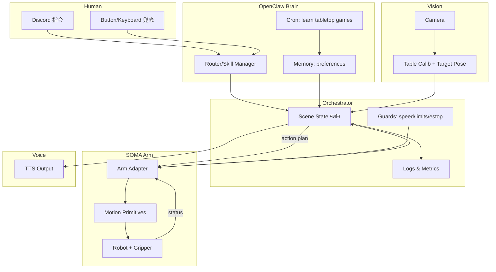

# Architecture｜Robot Arm Mahjong × OpenClaw

> 目标：把 OpenClaw 作为 **Brain/编排层**，机械臂作为 **执行器**，摄像头作为 **传感器**。
>
> 注：SOMA 机械臂“控制接口/SDK”需以厂商文档为准。本仓库先提供 **接口适配层（Adapter）** 设计，后续按实际 SDK 填充。

---

## 1) 分层（从上到下）

### L0 交互层（Human I/O）
- Discord 指令（Hackathon 最稳）
- 可选：按钮/键盘（保底触发）
- 语音输出（TTS）：让 Brain 有“人格/灵魂”

### L1 Brain（OpenClaw）
- 接收命令/事件（Discord/定时任务/传感器事件）
- 选择场景（Scene1-4）与“人格/台词风格”
- 调用技能（skills）执行：vision / arm / tts / orchestrator
- 记忆偏好（喜欢的台词、动作风格、安全等级、常用场景）

### L2 Orchestrator（状态机/可观测/安全）
- Scene 状态机：步骤编排、超时、重试、失败回 home
- 安全策略：限速/限位/工作区、急停
- 日志与指标：成功率、耗时、失败原因计数、最近一次动作轨迹

### L3 Perception（Vision）
- 桌面标定（推荐 AprilTag 或四角标定）
- 目标定位：输出 `target_pose`（x,y,theta）与置信度
- MVP 阶段允许降级：手动点击画面取点 / 固定弃牌区坐标

### L4 Actuation（Arm）
- SOMA（SO-ARM100 系列）机械臂动作库：`home / grasp / look_pose / place / tap3 / nod / shake / estop`
- 控制接口（已初步确认）：**UART → 总线伺服（STS3215）**
- 推荐：用 **LeRobot 的 Python 接口**做 Arm Adapter（避免我们自己直接撸 UART 指令集）
- 末端执行器（夹爪）与抓取稳定性

---

## 2) 数据流（Mermaid）



---

## 3) 统一接口协议（建议 v0）

### 3.1 Vision 输出（给 orchestrator）
```json
{
  "table_frame": {"type": "apriltag"},
  "target_pose": {"x": 0.42, "y": 0.18, "theta": 1.57},
  "confidence": 0.86
}
```

### 3.2 Arm Adapter API（给 orchestrator）
- `home()`
- `estop()`
- `grasp(pose)` / `push(pose)`（抓不稳时保底）
- `look_pose()`（“看牌”回收姿态）
- `place(pose)`（弃牌区固定 pose）
- `tap(times=3)` / `nod()` / `shake()`
- `status()`：返回关节角/是否忙/错误码

> 说明：无论 SOMA 提供什么 SDK（Python/ROS/HTTP），我们都在 `arm_adapter` 内部做适配，保证 orchestrator 不改。

---

## 4) “Brain 有灵魂”的实现方式（具体落地）

### 4.1 人格/捣蛋/抽象
- 台词库（礼貌版/梗版）+ 可配置“攻击性等级”
- 动作节奏：停顿、回收、点三点的时序 → 让机械臂显得“像在思考”

### 4.2 偏好与长期学习（Cron）
- Cron 每天抓取 1-3 条桌游/麻将梗/策略（来源可先手动）
- Brain 总结成卡片：`jokes.md` / `tactics.md` / `do_and_dont.md`
- 下一次演示时按偏好自动选择“梗版/礼貌版”与动作风格

### 4.3 安全与可验证
- Brain 生成的是“计划与参数”，不是直接生成电机指令
- 真正下发到机械臂前必须通过：
  - Guard（限速/限位/工作区）
  - Dry-run（空中走一遍轨迹）
  - 必要时 Human-confirm（第一次执行新动作/新参数）
