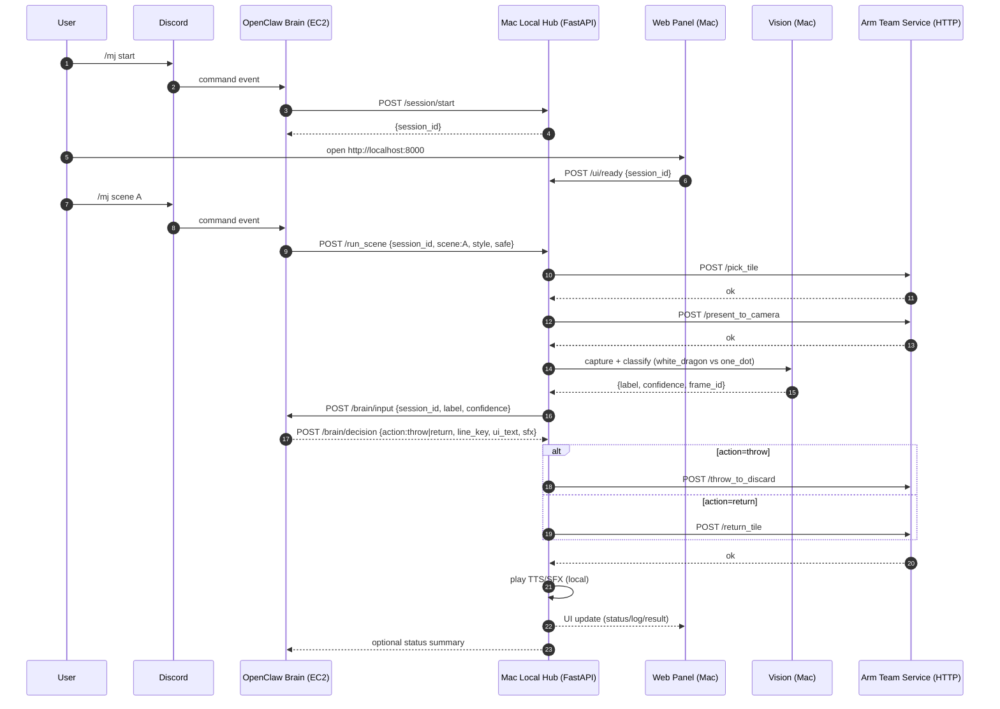

# Architecture & Flow (Participants · Data Flow · Sequence · API)

> Goal: enable parallel development across Brain (OpenClaw on EC2), Local Hub (Mac), Web UI, Vision, and Arm team.

---

## 1) Participants (Systems)

1. **Discord** (Input #1)
   - User sends `/mj start`, `/mj scene A|B`, etc.

2. **Web Control Panel (Mac browser)** (Input #2 + Output)
   - Shows camera preview, recognized result, logs, and action buttons.
   - Can send UI events (READY, CAPTURE, CONFIRM) to the local hub.

3. **OpenClaw Brain (EC2)**
   - Owns *decision-making* and personalization (persona/style/safe/prefs/cron learning).
   - Orchestrates scenes by calling the Mac Local Hub.

4. **Mac Local Hub** (Single source of truth for I/O)
   - Runs: FastAPI Orchestrator + Vision + local audio (TTS/SFX) + Web UI.
   - Talks to the Arm Team service (HTTP) and returns status/telemetry.

5. **Arm Team Service (same Wi-Fi)**
   - Provides arm primitives: pick/present/throw/return/home/estop/status.

---

## 2) Design Principles (to avoid “who is in charge” confusion)

- **Brain (OpenClaw on EC2) is ALWAYS the decision owner**.
- **Mac Local Hub is the I/O owner**: camera access, UI rendering, audio playback.
- Arm Team service is a pure actuator: it should not contain product logic.

---

## 3) Data Flow (high-level)

### Startup
1. User: `/mj start` in Discord
2. Brain: `POST /session/start` on Mac → returns `session_id`
3. Web UI: user opens `http://localhost:8000/` → UI sends `POST /ui/ready {session_id}`

### Scene A / B
1. Brain calls `POST /run_scene` on Mac.
2. Mac calls Arm Team service: pick → present.
3. Mac captures camera frame and runs minimal classification.
4. Mac notifies Brain with recognition result.
5. Brain responds with a **Decision Packet**.
6. Mac executes (throw/return) + plays TTS/SFX + updates UI.

---

## 4) Sequence Diagram (Mermaid)



---

## 5) API List

### 5.1 Mac Local Hub (FastAPI) — called by Brain and Web UI

**Session/UI**
- `POST /session/start` → `{session_id}`
- `POST /ui/ready` `{session_id}`
- `POST /ui/capture` `{session_id}` (optional)

**Run**
- `POST /run_scene` `{session_id, scene: "A"|"B", style: "polite"|"meme", safe: bool}`
- `GET  /status` → `{busy, last_scene, last_error, recognized, logs, ...}`
- `POST /stop`
- `POST /estop`

**Brain callbacks**
- `POST /brain/input` `{session_id, label, confidence, frame_id?}`
- `POST /brain/decision` `{session_id, action, line_key, ui_text, sfx}`

> Note: you can implement Brain callbacks either as **Mac→Brain** or **Brain→Mac** depending on network constraints. For hackathon, we recommend **Brain→Mac** (single outbound direction from EC2) if that’s simpler.

### 5.2 Arm Team Service (HTTP) — called by Mac

- `POST /pick_tile`
- `POST /present_to_camera`
- `POST /throw_to_discard`
- `POST /return_tile`
- `POST /home`
- `POST /estop`
- `GET  /status`

---

## 6) Minimal Decision Packet (Brain → Mac)

We keep it small and stable:

```json
{
  "session_id": "...",
  "action": "throw",
  "line_key": "LOOK_DONE",
  "ui_text": "I saw White Dragon. Throwing.",
  "sfx": "ding"
}
```

---

## 7) Parallelization Plan (who can work independently)

- Web UI: camera preview + status UI + buttons
- Vision: minimal 2-class classifier (white_dragon vs one_dot)
- TTS/SFX: audio assets + playback + style switching
- Orchestrator: state machine + timeouts/retries + logs
- Brain/Skill (OpenClaw): slash commands + persona + decision packet
- Arm Adapter: fill `http_arm.py` once endpoints/base_url are known
